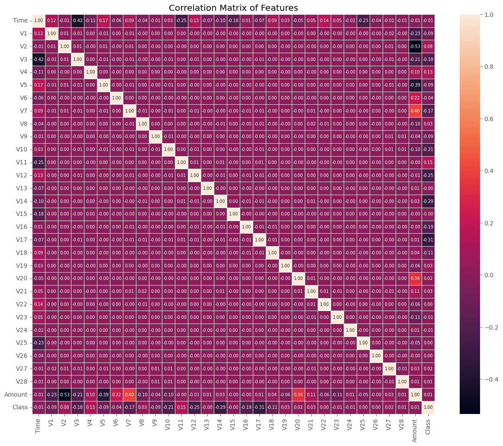

# Credit Card Fraud Detection on Imbalanced Data Using Machine Learning

---

## Table of Contents
1. [Introduction](#introduction)
2. [Dataset Overview](#dataset-overview)
3. [Exploratory Data Analysis (EDA)](#eda)
4. [Handling Imbalanced Data](#handling-imbalanced-data)
5. [Modeling and Evaluation](#modeling-and-evaluation)
6. [Save the Trained Models](#saving-model)
7. [Conclusion](#conclusion)

---

## Introduction 

Credit card fraud detection is a crucial application of machine learning in financial systems. However, fraud cases are rare, making the dataset highly imbalanced, which poses challenges for predictive modeling. This notebook demonstrates how to effectively address these challenges using machine learning techniques.

**Objectives:**
- Detect fraudulent transactions from credit card data.
- Handle the issue of data imbalance.
- Compare model performance and select the best approach.

---

## Dataset Overview 

The dataset used for this project contains transactions made by credit cards. It includes a highly imbalanced set of observations, where fraudulent transactions are a small fraction of the total.

**Features:**
- **V1-V28**: Principal components obtained via PCA.
- **Amount**: Transaction amount.
- **Time**: Time elapsed from the first transaction.
- **Class**: Fraud status (0 for non-fraud, 1 for fraud).

---

## Exploratory Data Analysis (EDA) 

To understand the data distribution and identify potential issues:

- Plot the distribution of features.
- Visualize the imbalance in the `Class` variable.
- Investigate correlations between features.

---

## Handling Imbalanced Data 

Given the highly imbalanced nature of the dataset, special techniques are applied:

- **Resampling**:
  - **Oversampling**: Synthetic Minority Oversampling Technique (SMOTE).
  - **Undersampling**: Random undersampling.
  
- **Evaluation Metrics**:
  - Accuracy may not be suitable for imbalanced data. We use:
    - Precision, Recall, F1-score, and ROC-AUC.

---

## Modeling and Evaluation 

We apply and evaluate several machine learning models:

1. **Logistic Regression**
2. **Decision Tree**
3. **Random Forest**

For each model:
- Train on the imbalanced dataset and again on resampled dataset.
- Evaluate performance using confusion matrices.
- Compare results based on evaluation metrics.

---

## Save the Trained Models 

After training and evaluating the machine learning models, it is crucial to save them for future use. This allows you to avoid retraining the models every time you need to make predictions and facilitates easy deployment.

In this step, we will save the trained models using Python's `joblib` library. This will enable us to load and use the models later without needing to retrain them.

We will save the model for `RandomForestClassifier`

## Conclusion 

In this analysis, we performed a comprehensive exploration and modeling process for credit card fraud detection using an imbalanced dataset. The steps included:

1. **Data Exploration and Preprocessing**: We began by loading and exploring the dataset, visualizing class imbalance, and performing necessary preprocessing steps.

2. **Correlation Analysis**: By investigating the correlations between features, we gained insights into how features interact with each other. This helped in identifying potential redundancies and understanding feature relationships.

3. **Handling Imbalanced Data**: We applied techniques such as undersampling and oversampling to address the class imbalance. This was crucial in ensuring that our models could better learn from the minority class.

4. **Model Training and Evaluation**: We trained and evaluated various classifiers, including Logistic Regression, Decision Tree, and RandomForest. We assessed model performance using metrics such as confusion matrices, classification reports, ROC-AUC scores, and ROC curves.

5. **Model Saving**: The trained models were saved for future use, ensuring that we can easily load and apply them for predictions on new data.

**Key Findings**:

- **Feature Correlations**: Our correlation analysis revealed important relationships between features. This understanding can guide feature selection and engineering in future analyses.

- **Model Performance**: The RandomForestClassifier demonstrated high accuracy in detecting fraud, showing that it is a strong candidate for deployment. The ROC-AUC scores and ROC curves provided insights into each model’s performance, particularly in distinguishing between fraudulent and non-fraudulent transactions.

- **Impact of Imbalance Handling**: Techniques for balancing the dataset were essential in improving model performance and ensuring that the minority class (fraudulent transactions) was adequately represented in the training process.

Overall, this analysis has provided a robust framework for credit card fraud detection. The insights gained from feature correlations and model evaluations will be instrumental in refining our approach and improving detection capabilities. Future work could involve fine-tuning models further, experimenting with additional features, and exploring other advanced techniques for handling imbalanced data.
